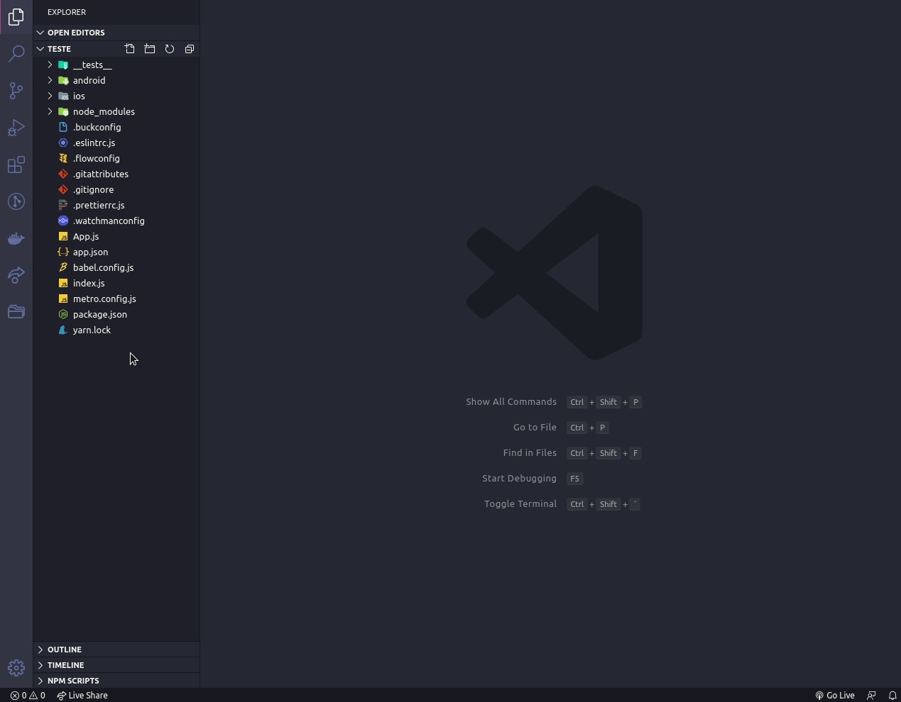

# EditorConfig

_Original text by Rocketseat: https://www.notion.so/EditorConfig-5f494ae4b47248c1b16681ff74d6766c_

## Configuração

Primeiro vamos configurar o Editor Config, que é uma ferramenta que auxilia na padronização da configuração para vários desenvolvedores trabalhando em um mesmo projeto, mas em diferentes editores de código ou IDE's.

Imagine que em um projeto existem desenvolvedores que utilizem o VSCode, o Sublime Text, o Atom ou até o WebStorm, em algum momento pode ser que eles estejam com configurações diferentes e isso acabaria gerando inconsistências no código.

Antes de começar as configurações do EditorConfig, vale ressaltar que as configurações são iguais para os projetos **NodeJS**, **ReactJS** e **React Native!**

Para configurar essa ferramenta a primeira coisa que vamos fazer é a instalação de uma extensão no VSCode chamada `EditorConfig for VS Code`, como mostrado abaixo:


[EditorConfig for VS Code - Visual Studio Marketplace](https://marketplace.visualstudio.com/items?itemName=EditorConfig.EditorConfig)

Depois de instalada, ao clicar com o botão direito sobre o explorador de arquivos do projeto vamos selecionar a opção `Generate .editorconfig` .



E a execução dessa opção deve gerar um arquivo `.editorconfig` com o seguinte conteúdo:

```json
root = true

[*]
indent_style = space
indent_size = 2
charset = utf-8
trim_trailing_whitespace = false
insert_final_newline = false
```

Nesse arquivo podemos ver algumas opções como o tipo de identação, o tamanho da identação, qual o charset que está sendo utilizado e algumas outras configurações.

O que vamos modificar nesse arquivo são apenas as 2 últimas opções, `trim_trailing_whitespace` e `insert_final_newline`, que devem ser modificadas de `false` para `true` .

Além de adicionar uma última opção, a `end_of_line = lf` , para garantir que as quebras de linha sejam padronizadas, pois em linguagem de código, no Windows o final das linhas são representadas por `\r\n` , já no Linux é apenas com `\n` , e para evitar que isso gere algum tipo de problema ao mudar de Sistema Operacional, essa opção é adicionada.

O arquivo final vai ficar assim:

```json
root = true

[*]
indent_style = space
indent_size = 2
charset = utf-8
trim_trailing_whitespace = true
insert_final_newline = true
end_of_line = lf
```

E para garantir que o código seja formatado corretamente, abra os arquivos do projeto e salve-os novamente.

Pronto, concluímos a instalação e configuração do nosso **EditorConfig**. Agora, vamos instalar e configurar o **[ESLint](Rocketseat-Notion-Padroes-ESLint.md).**

## Documentação

Para mais informações sobre as configurações do EditorConfig, você pode consultar a documentação oficial:

[EditorConfig](https://editorconfig.org/)